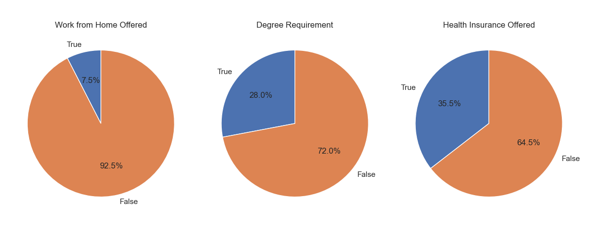
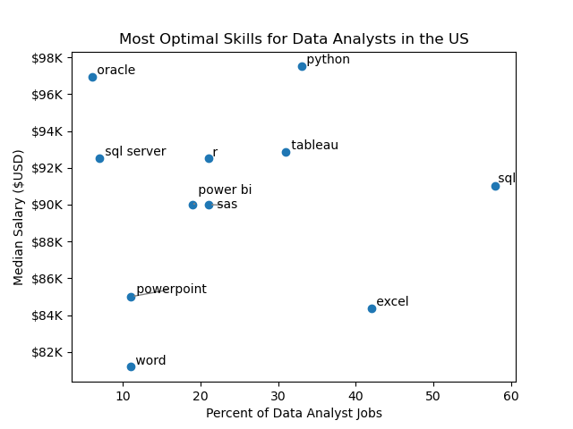
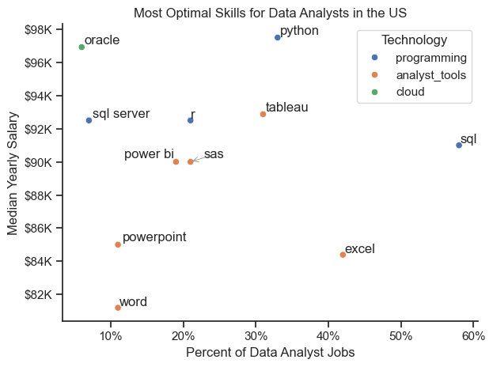
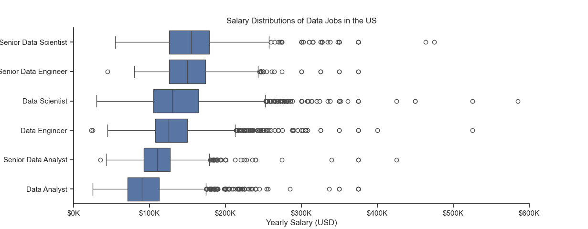
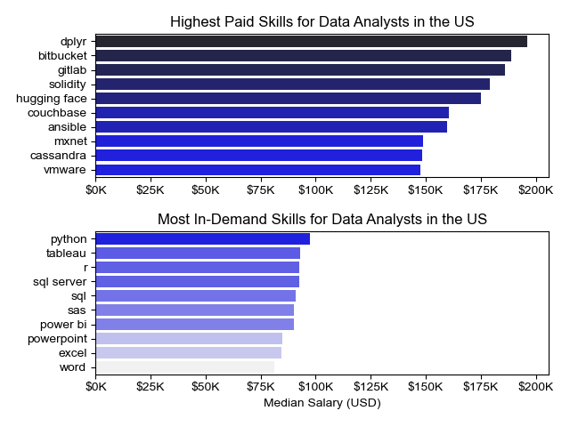
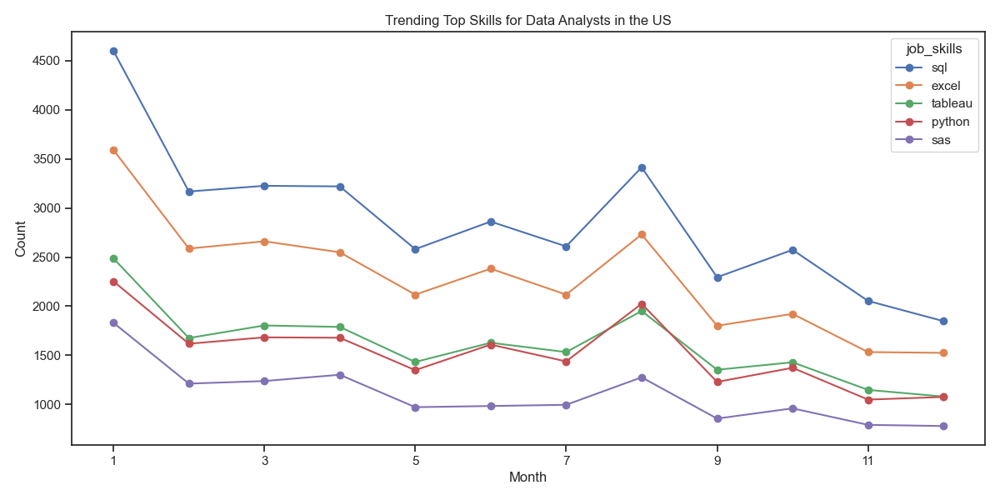
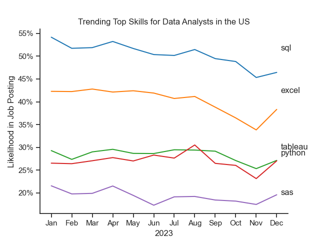

# 📊 Data Jobs Analysis Project

This project analyzes job postings data to uncover insights about **skills demand, salaries, and hiring trends** for Data Analysts in the United States.

---

## 📁 Project Structure

```
Python-Project/
│
├── 1_Python_Basics/        
├── 2_Python_Advanced/         
├── 3_Python_Project/       
│
├── requirements.txt
└── README.md
```

---

## 🚀 Features

* 📊 Skill demand vs salary analysis
* 📈 Monthly trending skills visualization
* 🏢 Top hiring companies insights
* 🧹 Data cleaning & transformation using Pandas
* 📉 Visualizations using Matplotlib & Seaborn

---

## 🛠️ Tech Stack

* Python 🐍
* Pandas
* Seaborn
* Matplotlib
* Hugging Face Datasets

---

## ⚙️ Installation & Setup

### 1. Clone the repository

```
git clone https://github.com/javedmir150481/Python_Project.git
cd Python_Project
```

### 2. Create virtual environment (recommended)

```
python -m venv venv
source venv/bin/activate   # Mac/Linux
venv\Scripts\activate      # Windows
```

### 3. Install dependencies

```
pip install -r requirements.txt
```

---

## 📊 Sample Outputs

* Job Opportunity Analysis



* Optimal Skills

* Optimal Technology Skills

* Salary Analysis

* Salary Skills Analysis

* Skills Trend

* Skills Trend Analysis


---

## 🔐 Data Source

Dataset: `lukebarousse/data_jobs` (Hugging Face)

---

## 📌 Future Improvements

* Add interactive dashboards (Plotly / Power BI)
* Deploy as web app
* Add machine learning predictions